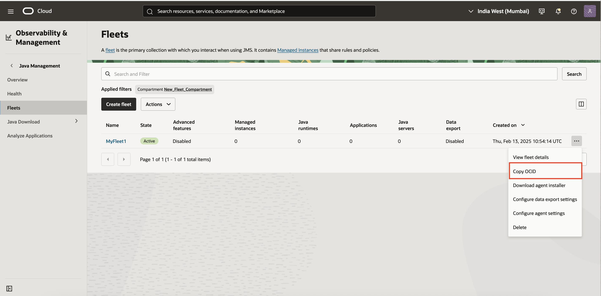

# Enable Java Management Service (JMS) for a Kubernetes Cluster

Java Management Service (JMS) leverages the OCI Management Agent, included in the OCI Kubernetes Monitoring solution, to monitor Java applications running in Kubernetes clusters. The JMS plug-in for the Management Agent enables seamless interaction between JMS and the clusters.

Follow the steps below to set up JMS with OCI Kubernetes Monitoring:


### Step 1: Set Up OCI Infrastructure for JMS Fleets
Refer to [the official setup guide](https://docs.oracle.com/en-us/iaas/jms/doc/setting-oracle-cloud-infrastructure-java-management-service.html) to prepare the required OCI resources for JMS.


### Step 2: Create a JMS Fleet
A fleet is the primary collection of managed instances used to interact with JMS.
To create a fleet, follow [these instructions](https://docs.oracle.com/en-us/iaas/jms/doc/creating-fleet.html).
Ensure to review and enable the [advanced features](https://docs.oracle.com/en-us/iaas/jms/doc/advanced-features.html) required for the fleet.

### Step 3: Register the Kubernetes Cluster as a Managed Instance in JMS
To be managed through JMS, the Kubernetes cluster needs to be registered as a Managed Instance:

#### 1. Prepare the configuration file
Create a file on the local machine(for example, `input.rsp`) and add the following content:
```
ManagementAgentInstallKey = <>
fleetId = <>
# Below line enables the JMS plugin for Kubernetes
Service.plugin.jm-container.download = true
```

#### 2. Get the required values
- Management Agent Install Key: Copy the install key created at this [installation step](../README.md#3-create-management-agent-install-key)

- Fleet ID: Navigate to the JMS Fleet created in Step 2 and copy the Fleet OCID
    


#### 3. Update the configuration file
Paste the values for the Management Agent Install Key and Fleet ID into the relevant fields in the configuration file.

#### 4. Generate a base64-encoded version
Encode the complete configuration file using base64. For the configuration file named as `input.rsp`,run the following command
```
$ base64 -i input.rsp
[...]
IyMj... Y29tCgoKCg==
```

#### 5. Provide the base64-encoded value
Copy the generated base64-encoded content and provide it as the value of `installKeyFileContent` in this [installation step](../README.md#5-update-valuesyaml)
```
oci-onm-mgmt-agent:
  mgmtagent:
    # Provide the base64 encoded content of the Management Agent Install Key file
    installKeyFileContent: <Paste the base64 value here>
```
